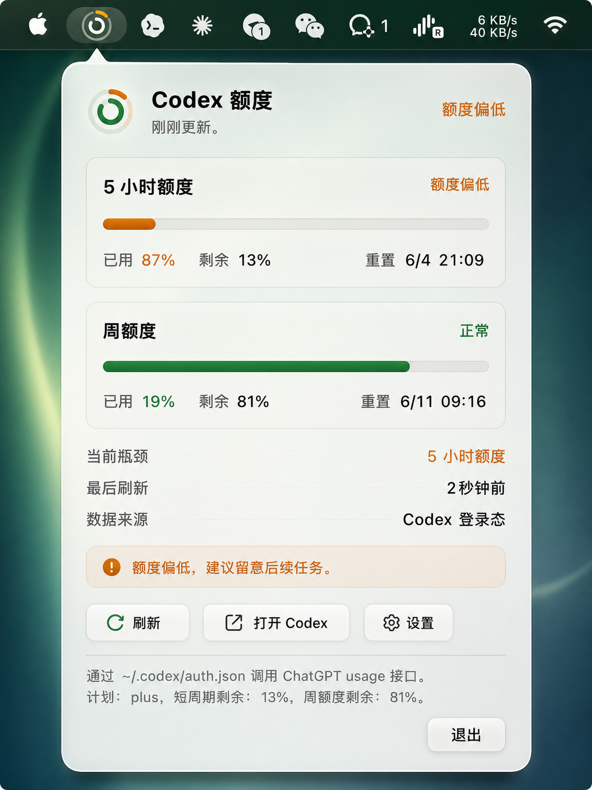

# Codex Quota Menubar

一个 macOS 原生菜单栏小工具，用来显示 Codex 额度状态。



## 功能

- **灵活的菜单栏显示**：支持“圆环（仅双层圆环）”与“百分比（仅文本，如 `Codex 80%`）”两种模式，可在设置中自由切换。
  - 在圆环模式下，外圈表示 5 小时额度，内圈表示周额度，高亮部分表示剩余比例。
- **直观的数据面板**：点击菜单栏图标展示下拉面板，分开展示 5 小时额度和周额度的已用、剩余百分比、当前状态与重置时间。
- **瓶颈额度高亮**：自动识别当前瓶颈额度，支持 5 小时额度与周额度并列瓶颈。
- **智能刷新机制**：支持手动刷新、定时自动刷新和系统睡眠唤醒后的自动恢复刷新。
- **低额度分段提醒**：支持 10%、20%、30%、40%、50% 五档自定义低额度状态提醒。
- **Telegram 手机推送**：支持 5 小时额度和周额度重置提醒、测试消息、Keychain 保存 Bot Token，并区分到期重置、疑似服务商调整和未知恢复。
- **无签名开机自启**：支持一键开启/关闭开机自启（基于 LaunchAgent 实现，未签名的 `.app` 构建产物也可直接使用）。

## 使用步骤

### 1. 构建项目

```bash
swift build -c release
```

### 2. 运行菜单栏工具

```bash
swift run -c release CodexQuotaMenubar
```

成功标志：mac 顶部栏出现对应的圆环图标或百分比文本。如果登录态不可用或请求失败，会显示置灰状态，点击能看到失败原因。

## 开发与验证

1. 构建：

   ```bash
   swift build
   ```

2. 测试：

   ```bash
   swift test
   ```

3. 一键检查：

   ```bash
   scripts/check.sh
   ```

成功标志：命令输出没有 error，测试报告显示所有测试通过。

## 安装为 App

为了日常稳定使用与支持开机自启，推荐将其打包为 `.app` 应用：

1. **生成 `.app` 包**：

   ```bash
   scripts/build-app.sh
   ```

2. **复制到应用程序目录**：

   将生成的 `dist/Codex Quota Menubar.app` 拖入系统的 `/Applications`（应用程序）目录。

3. **运行与开机启动**：
   - 首次运行时在 `/Applications` 中**右键 -> 打开**（绕过系统未签名公证的安全提示）。
   - 打开后在设置页面勾选“开机启动”即可。

   成功标志：系统 `~/Library/LaunchAgents/` 下会生成对应的 plist 引导文件，开机后自动拉起。

## 数据源说明

当前版本固定使用 Codex 登录态数据源，会：

- 读取 `~/.codex/auth.json` 中的 ChatGPT OAuth token
- 请求 `https://chatgpt.com/backend-api/wham/usage` 获取额度使用状况
- 解析 `primary_window` 映射为 5 小时额度，将 `secondary_window` 映射为周额度
- 自动根据剩余额度切换不同颜色（正常绿色、偏低橙色、接近耗尽红色）

**风险提示**：本工具请求的 usage 接口为 ChatGPT 网页端后端接口，非 OpenAI Platform 开放接口。该接口可能随着官方网站的更新而失效，请在信任本工具的情况下使用。

如果读取失败，工具会尽量区分 `auth.json` 缺失、token 刷新失败、usage 接口 HTTP 错误或接口结构变化，并在面板中显示最近失败原因。
