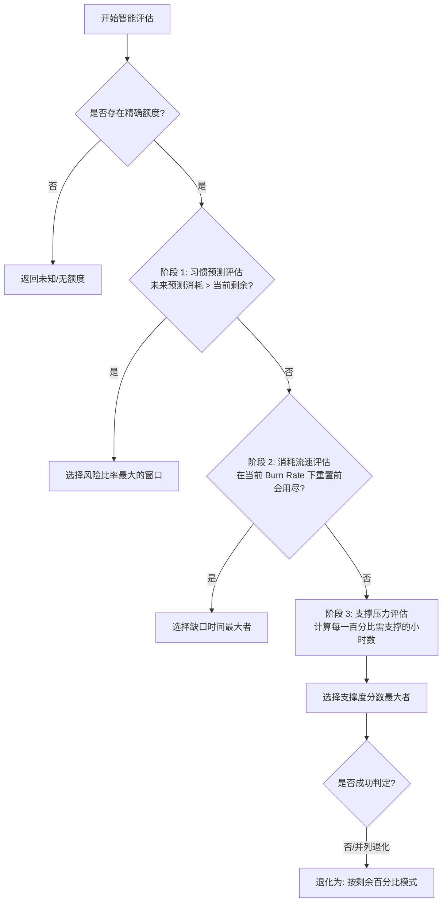

# Codex Quota Menubar 额度瓶颈计算规则

本文档整理了当前项目中关于**额度瓶颈（Quota Bottleneck）**的优化计算规则。系统目前支持"按剩余百分比"与"按使用趋势（智能模式）"两种判断逻辑，用于为用户推荐当前最紧缺、最需要关注的额度窗口（5 小时额度或周额度），并在菜单栏及主界面中进行展示。

---

## 一、 核心概念与数据模型

在系统计算中，额度包含两个主要的独立窗口：
*   **5 小时额度 (`fiveHour`)**：短期额度窗口，重置周期较快。
*   **周额度 (`weekly`)**：长期额度窗口，重置周期较慢。

计算输出的实体为 `QuotaBottleneckEvaluation`，其包含：
*   `windows`: 当前被判定为瓶颈的窗口列表（若并列，则包含多个）。
*   `remainingPercent`: 瓶颈窗口的剩余额度百分比。
*   `resetAt`: 瓶颈窗口的下一次重置时间（若并列，取最早重置时间）。
*   `text`: 界面显示的瓶颈文案（如"5 小时额度"、"周额度"或"并列瓶颈"）。
*   `explanation`: 详细的瓶颈原因说明，在用户悬停或查看详情时展示。

---

## 二、 计算规则详解

根据用户在设置中选择的 `BottleneckMode`，系统会采用不同的评估算法：

### 1. 按剩余百分比模式 (Percentage Mode)

这是最直接的比较方式。

*   **计算逻辑**：对比两个窗口的当前剩余百分比。
    $$\text{瓶颈} = \text{argmin}(\text{fiveHour.percentRemaining}, \text{weekly.percentRemaining})$$
*   **并列处理**：若两者剩余百分比完全相同，则判定为**并列瓶颈**。
*   **重置时间**：取所选瓶颈窗口的重置时间 `resetAt`（并列时取两者中较早的值）。
*   **兜底说明**：若暂未读取到精确额度，则瓶颈展示为"未知"。

---

### 2. 按使用趋势模式 (Smart Mode / 智能模式)

智能模式试图通过"预测未来消耗"、"评估当前流速"以及"分析重置防守压力"三个维度，更加聪明地找出当前真正制约用户的额度瓶颈。

智能模式采用**优先级级联判定（Cascading Evaluation）**，共有三个评估阶段。一旦在前面的阶段找到明确瓶颈，则直接返回，不再进入后续阶段：



#### 阶段 1：使用频率/习惯预测评估 (Usage Frequency Evaluation)
利用用户最近 **30 天** 在相同小时段（区分周中与周末）的历史平均消耗数据，预测从当前时刻至重置时间之间的总预测消耗量。

1.  **预测消耗量 (`predictedConsumption`)**：通过当前时间到重置时间之间每个小时的重叠比例，累加历史相同小时的平均消耗。
2.  **触发条件**：若某个窗口的预测消耗量大于当前剩余百分比：
    $$\text{predictedConsumption} > \text{percentRemaining}$$
3.  **指标排序**：计算风险比率：
    $$\text{riskRatio} = \frac{\text{predictedConsumption}}{\max(0.5, \text{percentRemaining})}$$
4.  **结果**：判定 `riskRatio` 最大的窗口为主要瓶颈。

> [!NOTE]
> 习惯预测能够帮助系统在用户即将迎来高频使用时段前（例如周中工作日上午），提前将对应窗口标记为瓶颈，起到预警作用。

#### 阶段 2：消耗速度与重置缺口评估 (Deficit Evaluation)
如果习惯预测未发现超额风险，系统将计算在当前实际消耗速度（`burnRate`）下，额度是否会在重置前提前用尽。

1.  **消耗速度 (`burnRate`) 计算**：
    *   **5 小时窗口**：利用最近 **3 小时** 的历史记录计算每小时平均消耗的百分比。
    *   **周窗口**：利用最近 **24 小时** 的历史记录计算每小时平均消耗的百分比。
    *   *注：仅在额度下降时才进行累加，排除"反弹"和重置增加的干扰。*
2.  **预计用尽时间 (`timeToDrainHours`)**：
    $$\text{timeToDrainHours} = \frac{\text{percentRemaining}}{\text{burnRate}}$$
3.  **重置缺口 (`deficitHours`)**：
    $$\text{deficitHours} = \max(0, \text{距离重置的小时数} - \text{timeToDrainHours})$$
4.  **结果**：若有窗口的 $\text{deficitHours} > 0$（即重置前就会用尽），则判定 **`deficitHours` 最大（即缺口最严重、最迫切用尽）** 的窗口为瓶颈。

#### 阶段 3：支撑度分数评估 (Support Evaluation)
如果当前消耗速度安全，所有窗口均没有用尽缺口（`deficitHours == 0`，包括处于未使用状态 `burnRate = 0` 时），则按防守压力进行评估。

1.  **支撑度分数 (`supportScore`)**：
    $$\text{supportScore} = \frac{\text{距离重置的小时数}}{\max(0.5, \text{percentRemaining})}$$
    *该分数代表了：在熬到重置之前，平均每一百分比（1%）的额度必须支撑多少小时。分数越大，说明重置时间越长或剩余额度越低，防守压力越大。*
2.  **结果**：判定 **`supportScore` 最大** 的窗口为瓶颈。

#### 兜底阶段 (Fallback)
如果上述三个阶段因数据缺失或分数完全相同等原因无法决定，则直接退化并采用**按剩余百分比模式**。

---

## 三、 当前规则中潜在的边界问题与优化空间

通过对源码的梳理，我们发现以下设计逻辑在特定边界情况下可能会对用户体验产生影响：

### 1. 单一窗口退化时的并列抖动
当使用"本机状态"或"手动填写"时，数据源可能仅能获取单个维度的额度（例如统一的剩余比例和重置时间）。
*   **问题**：这会导致 `fiveHour` 和 `weekly` 的数值和重置时间被初始化为完全一致。智能模式评估时，各阶段的得分也会完全一样，最终频繁触发退化并显示为"并列瓶颈"，在菜单栏中频繁闪烁或显示文案不友好。

### 2. `burnRate` 窗口硬编码与突发响应延迟
*   **5 小时窗口的 3 小时平均**：如果用户在过去 3 小时内没有使用，但在最近 10 分钟突然进行了极高强度的消耗，由于 3 小时的平均计算会将该消耗稀释，使得 `burnRate` 在短时间内依然偏低，导致系统无法及时警示用户 5 小时额度即将耗尽。
*   **周窗口的 24 小时平均**：如果用户在周末的 24 小时内完全未使用（`burnRate` 降为 0），即使周一上班时剩余周额度很低且马上开始大量消耗，系统在周一刚开始的几个小时内依然会计算出偏低的 `burnRate`，进而判定其没有缺口。

### 3. 低额度时的噪声放大 (`max(0.5, ...)` 极小值分母)
在习惯预测和支撑度评估中，为了防止除以 0，分母使用了限制值 `max(0.5, percentRemaining)`。
*   **问题**：当某个窗口的额度极低时（例如 1%），分母为 1.0。若习惯预测出微小的波动消耗（例如 1.5%），其计算得到的风险比率将达 1.5。这可能导致系统在两个额度都很充足、但某个额度因重置刚刚好剩得极少时发生过度警报。

### 4. 预测消耗的依赖性
习惯预测（阶段 1）重度依赖过去 30 天的 `QuotaUsageHourBucket` 历史数据。
*   **问题**：新安装或清理过数据的用户由于历史数据不足（`buckets.isEmpty`），会直接跳过阶段 1。此外，如果用户的作息习惯发生改变（例如从日间工作改为夜间工作），预测模型可能需要较长时间（多达 30 天的滑动窗口）才能完成纠偏。

---

## 四、 5 小时与周额度独立优化方案 (二次审视后定稿)

为了保证 5 小时窗口（短周期、高波动）和周窗口（长周期、重稳定）互不干扰且判定逻辑合理，经过两轮逐项审视，最终确认以下 **5 点分离优化设计方案**：

### 1. 支撑度分数归一化计算 (针对阶段 3)
原支撑度公式未考虑周期尺度，导致绝对时间较长的周窗口几乎总是胜出。
*   **优化方案**：将时间归一化到各自的**固定周期上限常量**（5 小时 vs 168 小时），而非使用实际剩余的 `resetHours`。
    *   **5 小时窗口的支撑度分数**：
        $$\text{supportScore}_{\text{5h}} = \frac{\text{距离重置小时数} / 5.0}{\max(0.5, \text{percentRemaining})}$$
    *   **周窗口的支撑度分数**：
        $$\text{supportScore}_{\text{weekly}} = \frac{\text{距离重置小时数} / 168.0}{\max(0.5, \text{percentRemaining})}$$
    *   通过对时间进行百分比化折算，两者支撑度将处于完全相同的比例尺度下竞争。

> [!IMPORTANT]
> 分母使用**固定周期常量**而非实际 `resetHours`。如果用实际 `resetHours`，公式退化为 `1 / max(0.5, percent)`，完全丢失时间维度信息。

#### 代码影响
修改 [QuotaModels.swift L533](file:///Users/qihui/code/tools/codex-quota-menubar/Sources/CodexQuotaMenubar/QuotaModels.swift#L533) 中的 `supportScore` 计算：
```diff
-let supportScore = remainingHours / max(0.5, Double(percent))
+let cycleDuration: Double = window.kind == .fiveHour ? 5.0 : 168.0
+let supportScore = (remainingHours / cycleDuration) / max(0.5, Double(percent))
```

---

### 2. 重置前用尽缺口改用"用尽时间"排序 (针对阶段 2)
原逻辑在两窗口同时存在超前用尽缺口时，直接比较绝对缺口小时数，导致紧急度偏高但绝对缺口偏小的 5 小时窗口被掩盖。
*   **优化方案**：分两步——
    1.  **保留 `deficitHours > 0` 作为门槛过滤**：仅筛选出会在重置前用尽的窗口。
    2.  **在已过滤的窗口中，选 `timeToDrainHours` 最小的**：即哪个窗口的额度最先彻底归零，哪个窗口就是当前第一紧急瓶颈。
    *   $$\text{瓶颈} = \text{argmin}(\text{timeToDrainHours}) \quad \text{(仅在 deficitHours > 0 的窗口中选)}$$

> [!NOTE]
> 若只有一个窗口 `deficitHours > 0`，则无需对比，直接选该窗口。`timeToDrainHours` 排序仅在**多个窗口同时存在缺口**时使用。

#### 代码影响
修改 [QuotaModels.swift L452-456](file:///Users/qihui/code/tools/codex-quota-menubar/Sources/CodexQuotaMenubar/QuotaModels.swift#L452-L456) 中的 deficit 判定逻辑：
```diff
 let deficitScores = scores.filter { $0.deficitHours > 0 }
-if let maxDeficit = deficitScores.map(\.deficitHours).max() {
-    let winners = deficitScores.filter { abs($0.deficitHours - maxDeficit) < 0.0001 }
+if let minTTD = deficitScores.compactMap(\.timeToDrainHours).min() {
+    let winners = deficitScores.filter {
+        $0.timeToDrainHours.map { abs($0 - minTTD) < 0.0001 } ?? false
+    }
     return result(from: winners, reason: .deficit)
 }
```

---

### 3. 流速 (Burn Rate) 引入时间衰减加权 (针对阶段 2)
解决简单平均流速对近期暴涨消耗不敏感、对长休静默数据反应慢的滞后问题。
*   **优化方案**：保留 5h 采样 3 小时、周采样 24 小时的窗口和 24 小时 / 50 条的历史保留策略不变。在计算 Burn Rate 时，对每段（相邻两条记录之间）的消耗采用**时间线性衰减加权**。
*   **权重计算基于每段的中点时间**：
    *   设第 $i$ 段由记录 $r_{i-1}$ 和 $r_i$ 构成。
    *   段中点时间：$\text{midpoint}_i = (r_{i-1}.\text{capturedAt} + r_i.\text{capturedAt}) / 2$
    *   距当前的时间差：$dt_i = \text{now} - \text{midpoint}_i$（单位：秒，转换为小时后使用）
    *   权重：$W_i = \max(0.01, 1.0 - \frac{dt_i}{\text{duration}})$
        *   对于 5h 窗口，$\text{duration} = 3$ 小时（即 `3 * 3600` 秒）
        *   对于周窗口，$\text{duration} = 24$ 小时（即 `24 * 3600` 秒）
    *   加权消耗流速：
        $$\text{burnRate} = \frac{\sum W_i \cdot \Delta \text{percent}_i}{\sum W_i \cdot \Delta \text{hours}_i}$$

> [!TIP]
> 使用段中点而非结束时间计算权重，对采样间隔不均匀的情况更鲁棒。一段跨度 30 分钟的消耗和一段跨度 2 分钟的消耗，各自的权重将基于其所处的时间位置而非边界点。

#### 代码影响
修改 [QuotaModels.swift L382-398](file:///Users/qihui/code/tools/codex-quota-menubar/Sources/CodexQuotaMenubar/QuotaModels.swift#L382-L398) 中的 burn rate 累加逻辑：
```diff
-var consumedPercent = 0.0
-var consumedHours = 0.0
+var weightedPercent = 0.0
+var weightedHours = 0.0

 for index in 1..<records.count {
     guard let previous = records[index - 1].percent,
           let current = records[index].percent else {
         continue
     }
     let elapsed = records[index].capturedAt.timeIntervalSince(records[index - 1].capturedAt)
     guard elapsed > 0, current < previous else { continue }

-    consumedPercent += Double(previous - current)
-    consumedHours += elapsed / 3600
+    let midpoint = records[index - 1].capturedAt.addingTimeInterval(elapsed / 2)
+    let dt = now.timeIntervalSince(midpoint) / 3600
+    let weight = max(0.01, 1.0 - dt / (duration / 3600))
+    weightedPercent += weight * Double(previous - current)
+    weightedHours += weight * (elapsed / 3600)
 }

-guard consumedHours > 0 else { return 0 }
-return consumedPercent / consumedHours
+guard weightedHours > 0 else { return 0 }
+return weightedPercent / weightedHours
```

---

### 4. 预测消耗超额风险时使用 1.5 倍加权 (针对阶段 1)
当两窗口在习惯预测阶段均显示出在重置前会发生超支时，合理判定优先级。
*   **优化方案**：在对比 `riskRatio` 时，为 5 小时窗口的 `riskRatio` 乘以 **1.5 倍加权系数**，然后再与周窗口对比。
    *   $$\text{adjustedRiskRatio}_{\text{5h}} = \text{riskRatio}_{\text{5h}} \times 1.5$$
    *   这样当周窗口风险明显高于 5 小时时（例如周窗口 riskRatio = 5.0，5h 加权后 = 1.5 x 1.2 = 1.8），周窗口仍能胜出。
    *   但当两者风险接近时，短周期窗口因容错率更低而获得适度优先。

> [!WARNING]
> **不采用**"无条件优先 5 小时窗口"的策略，因为这会导致周窗口真正紧急时被完全忽略。1.5 倍加权是一种柔和的偏好。

#### 代码影响
修改 [QuotaModels.swift L484-496](file:///Users/qihui/code/tools/codex-quota-menubar/Sources/CodexQuotaMenubar/QuotaModels.swift#L484-L496) 附近的 `UsageRisk` 构建或排序逻辑：
```diff
 return UsageRisk(
     window: window,
     prediction: prediction,
-    riskRatio: prediction.predictedConsumption / max(0.5, Double(percent))
+    riskRatio: {
+        let base = prediction.predictedConsumption / max(0.5, Double(percent))
+        return window.kind == .fiveHour ? base * 1.5 : base
+    }()
 )
```

---

### 5. 单一数据源退化展示优化 (同时适用于百分比模式和智能模式)
避免当两窗口数据完全并列时，界面显示含义不明的"并列瓶颈"。
*   **优化方案**：当两窗口的 `percentRemaining` **且** `resetAt` 完全相同时，不再判断为并列，而是**默认只将其判定为 `[.fiveHour]`（5 小时额度）** 瓶颈。
*   **适用范围**：同时应用于**百分比模式**和**智能模式**，保证两种模式下的表现一致性。

> [!IMPORTANT]
> 尽管当前数据源已固定为 `codexAuth`（[QuotaStore.swift L116-119](file:///Users/qihui/code/tools/codex-quota-menubar/Sources/CodexQuotaMenubar/QuotaStore.swift#L116-L119)），此保护逻辑仍然保留。原因：API 后端版本变化或降级场景下仍可能返回两窗口完全相同的数据。

#### 代码影响
修改 [QuotaModels.swift L633-638](file:///Users/qihui/code/tools/codex-quota-menubar/Sources/CodexQuotaMenubar/QuotaModels.swift#L633-L638) 中 `QuotaSnapshot.bottleneckWindows` 的并列判定：
```diff
 var bottleneckWindows: [QuotaWindowKind] {
     guard let percentRemaining else { return [] }
-    return [fiveHour, weekly]
-        .filter { $0.percentRemaining == percentRemaining }
-        .map(\.kind)
+    let matched = [fiveHour, weekly].filter { $0.percentRemaining == percentRemaining }
+    if matched.count == 2, fiveHour.resetAt == weekly.resetAt {
+        return [.fiveHour]
+    }
+    return matched.map(\.kind)
 }
```
